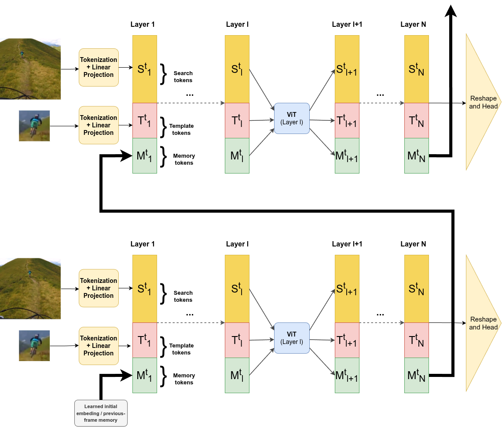
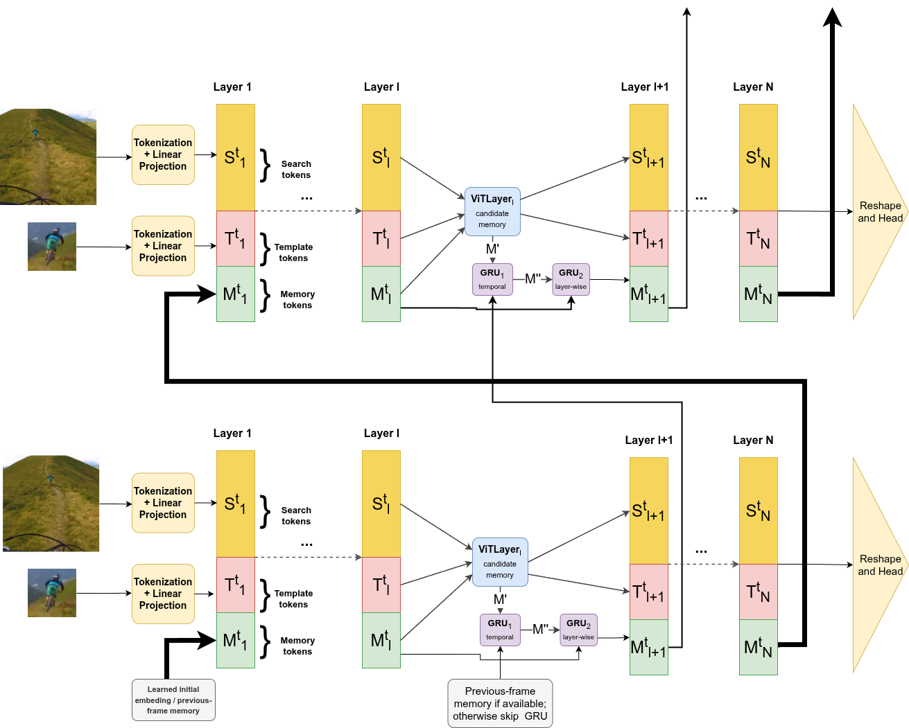
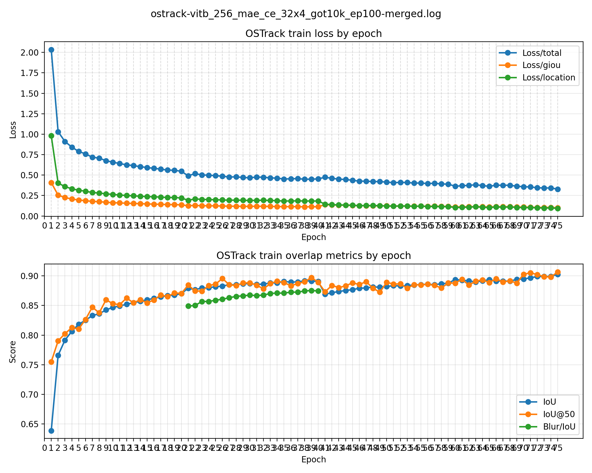
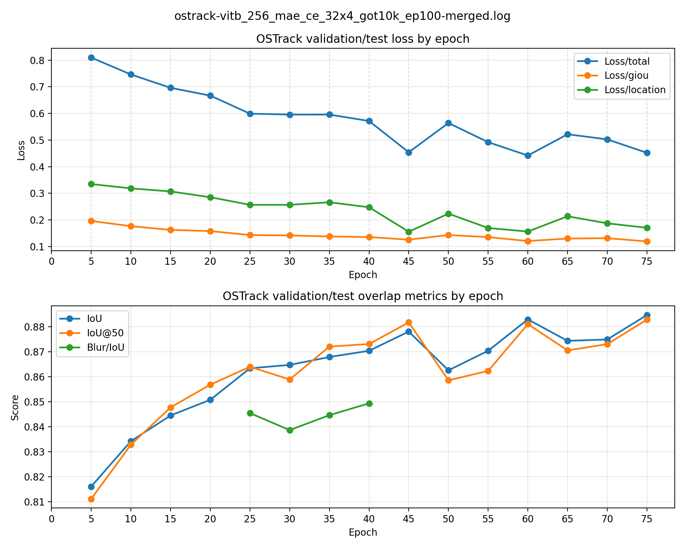

**Extending OSTrack with GRU-Based Memory Tokens for Visual Object Tracking**

Student's name and surname

Zagreb, June 2026

# Acknowledgements

# Table of Contents

Introduction

1\. Background and Related Work

2\. OSTrack Baseline

3\. Proposed Memory-Augmented OSTrack

4\. Sequence-Based and Inference-Like Training

5\. Auxiliary Memory Supervision

6\. Experimental Setup

7\. Results and Discussion

Conclusion

References

Abstract

Summary

Abbreviations

Appendix

# Introduction

Visual object tracking is the task of locating a target object throughout a video after
the target has been specified in the first frame. The tracker receives an initial
bounding box and then predicts the target position in each subsequent frame. Although
the input definition is simple, the task is challenging because the target can move,
change scale, deform, become partially occluded, or appear in a cluttered background.
A tracker must therefore combine the initial target description with current visual
evidence and, ideally, with temporal information collected during the sequence.

This thesis investigates a memory extension of OSTrack, a one-stream transformer
tracker. OSTrack is a suitable baseline because it jointly processes template and search
tokens in a single transformer backbone. The goal of this work is not to replace the
whole tracker, but to test whether explicit recurrent memory tokens can be inserted into
the OSTrack token stream and trained on video sequences in a meaningful way.

The proposed experimental model is called MemOSTrack. It extends the original
template-search token sequence with memory tokens and updates these tokens using a
two-stage gated recurrent unit (GRU) mechanism. The update combines temporal information
from previous frames with layer-wise memory refinement. This design is intended to give
the tracker an explicit recurrent state while preserving the main structure of the
OSTrack baseline.

The work is not limited to an architectural change. Independent template-search frame
pairs are insufficient for training the recurrent memory state in a realistic way,
because the memory state should evolve over an ordered sequence of frames. For this
reason, the sampling pipeline was first rewritten to return video frames as ordered
sequences. It was later extended with dynamic search cropping, where the next search
crop is generated from the previous prediction rather than from the current ground-truth
target position. This final version better matches the inference setting, where the
tracker does not know the target box after initialization.

The thesis also studies a practical problem that appears when adding memory to a strong
baseline: the new memory branch can be ignored. Auxiliary memory loss heads were
explored to make memory tokens predictive, and template blurring was considered as a
regularization strategy that weakens over-reliance on the clean initial template. These
ideas do not guarantee improvement, but they broaden the study from an architectural
modification to the training and supervision conditions required for a memory pathway to
carry useful temporal information.

The main contributions of the thesis are:

- introduction of recurrent memory tokens into the OSTrack ViT backbone;
- implementation of a two-stage GRU memory update;
- rewriting of the training sampler for ordered video sequences;
- implementation of inference-like dynamic search cropping;
- exploration of memory loss heads and template blurring;
- experimental comparison with CE-enabled OSTrack baselines at 256 and 384 search
  resolutions.

# 1. Background and Related Work

## 1.1 Single-object tracking - Somewhat mannualy reviewed

Single-object tracking is a sequential computer vision problem. In the first frame of a
video, the target is identified by a bounding box. In later frames, the tracker predicts
the target location without receiving additional manual annotation. This distinguishes
tracking from ordinary object detection: the class of the object is not enough, because
the tracker must follow a particular instance. If several similar objects are present,
the correct output is the original target, not merely any object of the same category.

*Given frames I_1, I_2, ..., I_T and the initial box B_1, a tracker predicts boxes
\hat{B}\_t for t \> 1.*

The tracker may also maintain an internal state. A memory-free tracker can be written as
a function of the template and the current search region, while a recurrent tracker
additionally uses a state carried from previous frames. This distinction is central to
this thesis, because MemOSTrack explicitly introduces recurrent memory tokens into
the OSTrack backbone.

Tracking is difficult because the visual appearance of the target is not fixed. The
target may rotate, deform, change illumination, become blurred by motion, or be partly
hidden. The background can contain objects that look similar to the target. The camera
may move, producing large apparent target displacement between frames. A tracking method
must therefore balance stability and adaptability: it should not drift to a distractor,
but it must adapt when the true target changes appearance.

Single-object tracking (SOT) is the task of localizing the same target object throughout
a video sequence, given only its bounding box in the first frame. Early tracking methods
were mainly based on hand-crafted appearance and motion models, including mean-shift
tracking \[1\], optical flow-based methods \[2\], particle filters \[3\], and template
matching approaches \[4\]. These methods were often efficient and conceptually simple,
but they struggled under large appearance changes, occlusion, background clutter, and
scale variation. Around the early 2010s, discriminative correlation filter trackers
became one of the dominant families in visual tracking. Methods such as MOSSE \[5\], CSK
\[6\], KCF \[7\], and DSST \[8\] learned online filters that could localize the target
efficiently in the frequency domain, while DSST also introduced a separate scale
estimation mechanism. Later, more advanced correlation-filter trackers such as ECO \[9\]
improved robustness by using more compact model updates and stronger feature
representations. This period is commonly treated as the correlation-filter era of SOT,
before deep Siamese and transformer-based trackers became the dominant direction.

*Table 1.1 - Common tracking challenges.*

| **Challenge**      | **Example**                                      | **Why it is difficult**                                            |
|--------------------|--------------------------------------------------|--------------------------------------------------------------------|
| Occlusion          | Target is partially hidden                       | The visible evidence becomes incomplete and the tracker may drift. |
| Scale change       | Target approaches the camera                     | The size of the target box changes over time.                      |
| Deformation        | Person, animal, or flexible object changes shape | Appearance no longer matches the initial template exactly.         |
| Background clutter | Similar objects in the scene                     | The tracker can confuse target and distractor.                     |
| Motion blur        | Fast motion or camera movement                   | Fine details disappear from the search crop.                       |
| Out-of-view motion | Target leaves and returns                        | The tracker state may be corrupted during absence.                 |

## 1.2 From Siamese trackers to transformer trackers - Mannualy reviewed

The state of the art in single-object tracking has largely focused on template-to-target
matching, where the tracker relies on visual cues from two image regions: a template
crop that describes the target appearance and a search crop in which the target has to
be localized. A major step in this direction was introduced by SiamFC \[10\], which
formulated tracking as a fully convolutional Siamese matching problem between an
exemplar image and a larger search image. Later, SiamRPN \[11\] extended this idea by
combining Siamese feature extraction with a region proposal subnetwork, allowing the
tracker to perform target classification and bounding-box regression. In these early
Siamese trackers, the template and search images are processed by two branches with
shared convolutional weights, after which the extracted features are compared or fused
to estimate the target location.

Later trackers introduced transformer-based components for richer relation modeling
between the target and the search region. STARK \[12\] used an encoder-decoder
transformer to model global spatio-temporal dependencies and to directly predict the
target bounding box. OSTrack \[13\] further simplified the tracking pipeline by
introducing a one-stream transformer framework. Instead of extracting template and
search features independently and then applying a separate relation module, OSTrack
jointly processes template and search tokens inside the same backbone, so that feature
extraction and relation modeling are unified. Recent high-performing trackers on GOT-10k
include temporal and autoregressive models such as ODTrack \[15\], ARTrackV2 \[16\], and
ARPTrack \[17\]. These models indicate that recent tracking research increasingly
explores stronger temporal modeling, token propagation, and sequence-level pretraining.

All of these models share a similar high-level tracking structure. They accept a
template crop, which represents how the target looks, and a search crop, which contains
the region of the current frame where the target is expected to appear. The tracker then
extracts visual features from these two inputs and estimates the target position by
comparing, fusing, or jointly modeling the template and search representations. The main
architectural differences lie in how these features are extracted and how the relation
between the template and search region is modeled: earlier Siamese trackers rely mainly
on convolution and cross-correlation, while transformer-based trackers use attention
mechanisms to allow richer interaction between template and search features.

It is also important to note that feature extraction in modern trackers is often based
on pretrained backbones. These backbones are trained on large-scale image or video
datasets before being adapted to tracking. This is important because tracking datasets
alone are usually not sufficient for learning strong low-level and semantic visual
features from scratch. In practice, the pretrained backbone provides general visual
representations, while tracker training teaches the model how to use these
representations for target localization and target-background discrimination.

Another important family of trackers is represented by DiMP \[18\]. Unlike purely
Siamese approaches that mainly compare a fixed template with the current search region,
DiMP learns a discriminative target model during tracking. Its main idea is to predict a
target-specific classifier that can distinguish the target from the background using
information available from the video sequence. This makes DiMP especially relevant to
this thesis because it explicitly uses sequence information to adapt the target model
online, instead of relying only on a static initial template. The later PrDiMP \[19\]
extends this direction with a probabilistic regression formulation for visual tracking.
Although DiMP-style trackers are architecturally different from OSTrack, they show that
online adaptation and sequence-level information can improve tracking robustness. This
motivates the idea of adding recurrent memory to a template-search transformer tracker.

## 1.3 Template and Search Crop Notation - Mannualy reviewd

This thesis follows the standard template-search notation used in many modern
single-object trackers. The **template crop** is denoted by \(T\). It is extracted from
the first annotated frame and contains the target object we are tracking.
It is used to provide the visual description of the object that must be tracked.

The **search crop** at time \(t\) is denoted by \(S_t\). It is extracted from the
current frame around the expected target location. Usually, a neural-network tracker does not process the full image directly.
Instead, it receives a smaller resized crop around the expected target location.
This location is usually estimated from the bounding-box prediction in the previous frame.

There are two main reasons what can help understand why a search crop is used instead of the whole image. First,
it reduces computation by allowing the model to process only the region where the target
is expected to appear. This is especially important for transformer-based trackers,
because transformer-style attention is quadratic in the number of tokens [21]. For
example, with \(16 \times 16\) patches, a \(256 \times 256\) search crop contains 256
tokens, whereas a full HD frame would contain more than 8000 tokens. The corresponding
attention matrix is therefore much smaller for the search crop than for the full image.

Second, the search crop provides a useful spatial prior. Since the crop is usually
centered around the previous target bounding box, it gives the tracker information about
where the target was located in the previous frame and what its approximate scale was.
In short-term tracking, the target is usually expected to remain near its previous
location, so a local search region is often sufficient. The tracker then predicts the
new target box inside this resized crop, and the prediction is converted back to the
coordinate system of the original image.

In many trackers, the template is cropped only at initialization and remains fixed during
the sequence. Other trackers update or maintain an additional target representation
during inference. FEAR [14], for example, uses a dual-template representation for object
model adaptation, where a dynamic template complements the initial template during
tracking.

In contrast, trackers such as OSTrack store only the initial template extracted from the
first frame and do not maintain an explicit updated visual template during inference.
This makes the tracker dependent on the initial target appearance. If the target rotates,
deforms, changes illumination, or becomes partially occluded, the initial template may no
longer describe the current appearance well. The proposed memory mechanism is designed to reduce this limitation. 
MemOSTrack adds latent recurrent memory tokens inside the transformer
token sequence. These memory tokens are intended to store additional temporal cues about
the changing target appearance.

## 1.4 Evaluation metrics and common benchmarks

Because single-object tracking is a widely studied problem, it has established
benchmarks and evaluation metrics. These benchmarks make it possible to compare trackers
under a common protocol, using the same test sequences and the same localization
measures.

In this thesis, the main benchmark is GOT-10k. GOT-10k is a generic object tracking
benchmark designed to evaluate how well a tracker generalizes to unseen object classes
[20]. It follows a one-shot tracking protocol: the target is specified by a bounding box
in the first frame, and the tracker must localize the same object in the remaining
frames. The test annotations are hidden, so final results are obtained through the
official evaluation server.

The standard localization measure used in these evaluations is intersection over union
(IoU), also called overlap. For a predicted box and a ground-truth box, IoU is the area
of their intersection divided by the area of their union. A value of 1 means perfect
overlap, while a value of 0 means that the boxes do not overlap.

$$
\operatorname{IoU}(B_{\text{pred}}, B_{\text{gt}})
=
\frac{|B_{\text{pred}} \cap B_{\text{gt}}|}
{|B_{\text{pred}} \cup B_{\text{gt}}|}
$$

GOT-10k reports Average Overlap (AO), SR0.50, and SR0.75 [20]. AO is computed
as the average IoU over all evaluated frames:

$$
\operatorname{AO}
=
\frac{1}{N}
\sum_{i=1}^{N}
\operatorname{IoU}(B^{i}_{\text{pred}}, B^{i}_{\text{gt}}).
$$

SR0.50 is the proportion of frames whose overlap is at least 0.50, while SR0.75 is the
proportion of frames whose overlap is at least 0.75. SR0.75 is stricter and is more
sensitive to precise localization errors. These metrics are useful together because a
tracker may localize the target approximately while still producing less accurate
bounding boxes.

## 1.5 Motivation for temporal memory

The motivation for adding temporal memory to a tracker comes from several limitations
of using only the initial template and the current search crop. First, the initial
template becomes less reliable as the video progresses. It captures the target only in
the first frame, while the target may later rotate, deform, change illumination, change
scale, or become temporarily occluded. The current search crop can also be unreliable:
the object may be blurred, partly hidden, or surrounded by visually similar distractors.
In such cases, a tracker needs a mechanism that can dynamically encode the most relevant
appearance cues from previous frames instead of relying only on the first template.

Second, tracking is inherently temporal. A simple thought experiment makes this clear would be to 
imagine looking at a single frame of grass and trying to identify a camouflaged snake.
In that one image, the snake may be almost indistinguishable from the background,
however, once the video starts playing, coherent movement across consecutive frames can
make the same object visible. The object has not necessarily changed its appearance, but
the temporal context makes it easier to separate from the background. Additionally, a temporal memory can potentially encode motion cues. A memory state does not need
to store only appearance; it can also learn information about recent target movement,
direction, speed, and stable object identity across frames. This can be useful when the
current frame is ambiguous, because the previous trajectory and recent observations can
provide additional evidence about where the target is likely to be.

A simple way to use temporal information would be to provide the transformer with tokens
from previous frames together with the current search crop. However, this quickly leads
to a temporal token explosion. For example, if one search crop contains 256 tokens, then for just
20 previous search crops already contain 5120 tokens before adding template tokens. Even
if previous-frame key-value representations are cached, the
current frame must still attend to a growing set of stored tokens, increasing both memory
usage and attention cost.

Therefore, instead of storing all previous visual tokens, an efficient tracker requires
a reliable mechanism for dynamically maintaining a compressed hidden state. Such a state
should preserve useful temporal cues from previous frames while keeping computation
bounded as the sequence length increases.

# 2. OSTrack Baseline

## 2.1 One-stream transformer tracking

OSTrack is a one-stream, one-stage transformer tracker. The term one-stream means that
template and search tokens are processed together in a single backbone instead of being
encoded separately and then matched by a separate relation module. The term one-stage
means that feature extraction and relation modeling are unified inside the transformer
backbone. The OSTrack paper argues that this joint processing creates bidirectional
information flow between template and search tokens and allows target-oriented features
to be learned through their interaction [13].

In a simplified notation, let \(T_{t,l}\) denote template tokens and \(S_{t,l}\) denote
search tokens at layer \(l\) for frame \(t\). In the baseline without memory tokens, a
transformer layer processes their concatenation:

\[
[T_{t,l}, S_{t,l}] =
\operatorname{ViTLayer}_l([T_{t,l-1}, S_{t,l-1}]).
\]

The search tokens after the final backbone layer are passed to a prediction head. In the
original OSTrack design, the search tokens are reshaped into a spatial feature map and
processed by a lightweight fully convolutional head that predicts a classification score
map, local offsets, and normalized box size. These outputs are then used to obtain the
target bounding box. The exact head implementation is not the main focus of this thesis.
What matters for this work is that the baseline has no explicit recurrent state that is
propagated across frames inside the backbone.

The one-stream structure is effective because template-search interaction is not
delayed until after independent feature extraction. Each transformer layer can propagate
information between the template and search tokens. This also creates a challenge for
memory research: because the baseline already has a strong template-search pathway, a
new memory pathway may be ignored unless the training setup makes temporal information
useful.

## 2.2 ViT backbone used in this thesis

OSTrack is built on a Vision Transformer backbone. In this thesis, the standard
ViT-based OSTrack backbone is augmented rather than replaced. A Vision Transformer
divides an image into fixed-size patches, embeds each patch as a token, adds positional
information, and processes the resulting sequence with transformer encoder layers [22].

OSTrack adapts this ViT structure to visual object tracking. The template crop and the
search crop are both converted into patch tokens and then processed together by the same
transformer backbone. Therefore, the backbone does not only extract visual features; it
also models the relationship between the target template and the current search region.
In this way, OSTrack unifies feature extraction and template-search interaction inside
one transformer stream [13].

The evaluated MemOSTrack configuration follows the OSTrack-256 + CE backbone setting.
It uses the `vit_base_patch16_224_ce` backbone with a \(128 \times 128\) pixel template
crop and a \(256 \times 256\) pixel search crop. The name follows the implementation
naming convention; the actual configured crop sizes are the template and search sizes
stated here. With the ViT-B/16 patch size, these crops correspond to 64 template tokens
and 256 search tokens. The 256-pixel search resolution, ViT-B/16 backbone family, and
CE-enabled token-pruning mechanism make this configuration the closest direct comparison
to OSTrack-256 + CE from an architectural point of view.

It is also important that OSTrack uses a pretrained ViT backbone. The original OSTrack
paper shows that backbone initialization has a significant effect on tracking
performance, with pretrained ViT models performing much better than training the
backbone from scratch [13]. This is expected because tracking datasets are usually not
large enough to learn strong general-purpose visual features without pretraining. In
this thesis, the model uses the MAE-pretrained ViT-Base
checkpoint, following the OSTrack configuration. MAE pretraining teaches the backbone
useful visual representations by masking image patches and training the model to
reconstruct the missing content [24]. This makes the backbone a strong starting point
for tracking, while the proposed memory extension can be studied as an augmentation of
the existing OSTrack architecture rather than as a completely new feature extractor.

The main same-resolution baseline in this thesis is OSTrack-256 + CE. This baseline is
the closest comparison because it uses the same search resolution, the same ViT-B/16
backbone family, and the same CE-enabled pruning mechanism. This makes the
configuration architecturally aligned with OSTrack-256 + CE.

## 2.3 Candidate elimination

OSTrack introduces candidate elimination (CE) to reduce the number of search tokens
processed by the transformer backbone. In a template-search tracker, the search crop
contains both the target and many background patches. CE removes search tokens that are
unlikely to correspond to the target, reducing computation while keeping the most
relevant candidates [13].

OSTrack chooses candidates using attention between the template and search tokens. After
the multi-head attention operation in a transformer block, a representative template
token is used to score the search tokens. In the standard setting, this representative
token is the center template token, because the target is normally centered in the
template crop. If this token is denoted by \(\phi\) and the transformer has \(M\)
attention heads, the score of search token \(x\) is computed by averaging attention from
\(\phi\) to \(x\) over all heads:

$$
w_x^{\phi} = \frac{1}{M}\sum_{m=1}^{M} w_x^{\phi}(m).
$$

Search tokens with the highest scores are kept, while lower-scoring search tokens are
removed from the sequence for later transformer layers. If \(k\) tokens are kept from
\(n\) current search tokens, the keep ratio is:

$$
\rho = \frac{k}{n}.
$$

The kept search-token indices can be written as:

$$
I_{\text{keep}} = \operatorname{TopK}(w_x^{\phi}, k).
$$

The original order and positions of the remaining search tokens are stored. Before the
prediction head, the kept search tokens are restored to their spatial order and the
removed positions are zero-padded so that the spatial search feature map can be
reconstructed [13].

This matters for MemOSTrack because the proposed model adds memory tokens to the OSTrack
token sequence. In this implementation, CE is applied only to search tokens. Template
tokens are preserved, and memory tokens are also preserved because they are recurrent
latent states rather than spatial search candidates. Memory tokens participate in
attention, but they are not used to score search candidates and are not removed by CE.
Thus, candidate elimination keeps its original role of pruning search-region candidates,
while the recurrent memory stream remains available throughout the backbone.

# 3. Proposed Memory-Augmented OSTrack

## 3.1 Memory-token design motivation

MemOSTrack extends OSTrack by adding explicit memory tokens to the transformer backbone.
These memory tokens are inserted into the same token sequence as the template
and search image feature embeddings, so they participate in ViT attention together with the visual
tokens. However, unlike template and search tokens, memory tokens are latent hidden-state vectors
rather than image patches, and they are carried across frames during tracking.

This design allows the ViT backbone to continuously read from and refine the memory representation
through attention. Visual tokens can interact with memory tokens while the current
template and search features are processed, and the resulting memory representation can
store information that may be useful in later frames. 

The architectural changes are mainly applied inside the backbone. The patch embedding
and OSTrack prediction head are kept close to the baseline implementation, so the model
remains an OSTrack-style tracker with an added recurrent memory stream.

## 3.2 Direct transformer-based memory update

The first architectural variant adds memory tokens to the OSTrack backbone and lets the
ViT layers update them directly. In this version, memory tokens are concatenated with
the template and search tokens and are processed by the same transformer layers as the
visual tokens. The goal is to test whether the existing transformer operations,
including self-attention, residual connections, and feed-forward layers, are sufficient
to learn a useful memory update strategy.

In the direct transformer-based update, each ViT layer produces transformed search,
template, and memory tokens in a single forward pass:

$$
[S_{t,l}, T_{t,l}, M_{t,l}]
=
\operatorname{ViTLayer}_l
\left(
[S_{t,l-1}, T_{t,l-1}, M_{t,l-1}]
\right).
$$

Here:

- \(S_{t,l}\) denotes the search tokens after layer \(l\) while processing frame \(t\);
- \(T_{t,l}\) denotes the template tokens after layer \(l\) while processing frame \(t\);
- \(M_{t,l-1}\) is the memory input from the previous transformer layer in the current
  frame;
- \(M_{t,l}\) is the memory output produced directly by the ViT layer.

All token groups have the same embedding dimension \(D\), so they can be concatenated
along the token dimension and processed by the same transformer block.

For the first frame of a sequence, no previous memory state exists. The model therefore
uses a learned initial memory state. Then, after each frame has been processed, the backbone
returns an updated memory state in the auxiliary output. 
This updated memory state is then provided to the backbone when processing the next
search frame, together with the template and the next search crop.

To distinguish memory tokens from visual tokens, the model adds a learned memory-token
type embedding to the memory tokens before they are processed by the backbone. This
embedding shifts the memory tokens in feature space and gives the transformer a learned
signal that these prefix tokens represent memory states rather than image patches.

In the CE-enabled backbone, memory tokens are intentionally excluded from
candidate-elimination decisions. First, they are not pruned, because CE removes only
search tokens. Second, they are excluded from the template mask used for CE scoring, so
they do not directly influence which search tokens are kept or removed. Thus CE pruning is decided without
treating them as either removable candidates or scoring tokens, so memory
tokens can only influence it indirectly through the participation in the transformer attention.

*Figure 3.1 - Direct transformer-based memory update. The template and search images are
first converted into visual tokens by tokenization and linear projection. A learned
initial memory state, or the memory state returned from the previous frame, is inserted
into the transformer token sequence. Each ViT layer jointly processes search, template,
and memory tokens through self-attention. The updated memory state is passed through the
backbone and returned for use in the next frame, while the final visual tokens are
reshaped and passed to the OSTrack prediction head.*

## 3.3 Limitations of direct memory update

The direct-update variant exposes two fundamental limitations regarding long-term
temporal modeling. While the standard Vision Transformer architecture is effective for
spatial feature extraction and template-search matching, relying on it alone for
recurrent memory updates is insufficient.

The first limitation is the lack of explicit gating for memory preservation. In the
direct variant, memory tokens are updated by the same transformer block as the visual
tokens. For a standard pre-normalization transformer layer, the output of the attention
sublayer is defined by a residual connection:

$$
X'_l =
X_{l-1}
+
\operatorname{MSA}
\left(
\operatorname{LN}(X_{l-1})
\right).
$$

Here, \(X_{l-1}\) represents the input token sequence, including search, template, and
memory tokens. \(\operatorname{LN}(\cdot)\) denotes Layer Normalization, and
\(\operatorname{MSA}(\cdot)\) denotes Multi-Head Self-Attention.

While the attention mechanism is effective for determining which visual tokens should
influence the memory state, it does not provide a dedicated mechanism for controlling
how much of the existing memory should be preserved. The residual connection described
by the equation above can carry the previous token representation forward. However, it
adds the previous token representation and the new attention update without explicitly
deciding how much each should contribute.
Over long tracking sequences of tens or hundreds of frames, the lack of explicit gating can become a limitation. In the
direct-update variant, repeated ungated updates risk gradually making the memory state
drift or become less representative of the target.

The second limitation is the susceptibility to gradient explosion or vanishing during Backpropagation Through Time 
due to an absence of temporal skip connections. In recurrent neural networks, we often have temporal skip connections 
between the memory representations of the same layer across time. However, in our direct-update design, recurrence is 
present only in the form of a feedback loop, where the last layer of the current frame is connected to the first layer 
of the next frame. This means that when unrolling the memory tokens over $T$ frames through an $L$-layer backbone, 
the gradient has to travel through all layers of the backbone for each frame:

$$ 
\frac{\partial L_T}{\partial M_1} = \frac{\partial L_T}{\partial M_T} \prod_{t=2}^{T} \prod_{l=1}^{L} \frac{\partial M_{t,l}}{\partial M_{t,l-1}} 
$$

-where $L_T$ is the loss at frame $T$, $M_1$ and $M_T$ are the memory states at the first and last frames, 
-and $\frac{\partial M_{t,l}}{\partial M_{t,l-1}}$ represents the local Jacobian matrix at layer $l$ of frame $t$. 

Because the search and template tokens do not propagate their hidden states across frames, 
the temporal gradient flow relies exclusively on the partial derivatives of the memory tokens, 
$\frac{\partial M_{t,l}}{\partial M_{t,l-1}}$. 
Suppose we have a 12-layer transformer backbone over a 20-frame sequence;
this chain expands to 240 sequential Jacobian matrix multiplications. This deep computational graph can quickly result 
in error accumulation, causing gradient vanishing or explosion. One way to deal with it would be an addtiona of proper skip connections.

To address both memory drift and the gradient instability, a more
intentional architectural design is required. The second architectural variant decouples the proposal of new memory 
from the update of the memory
state. In this proposed design, the transformer output is treated as a candidate
memory representation, \(M'_{t,l}\). A two-stage Gated Recurrent Unit (GRU) mechanism is
then introduced. The first GRU fuses the candidate with the previous-frame memory to
create an explicit temporal skip connection, while the second GRU fuses the result with
the previous-layer memory to provide a gated depth path. This design provides a controlled memory-update path
across time and depth.

## 3.4 Variant B: GRU-based memory update and two-stage architecture

The second experiment adds a gated recurrent update to the memory stream. A gated
recurrent unit (GRU) is a recurrent module that updates a hidden state using learned
gates [23]. These gates control how much previous state is preserved and how much new
information is accepted. This is useful for memory tokens because the tracker should
retain reliable target information while still adapting when the target appearance
changes.

In this version, the transformer layer does not directly produce the final memory.
Instead, it produces a candidate memory value:

$$
[S_{t,l}, T_{t,l}, M'_{t,l}] =
\mathrm{ViTLayer}_l([S_{t,l-1}, T_{t,l-1}, M_{t,l-1}]).
$$

The value $M'_{t,l}$ is the memory suggested by attention at the current frame
and layer. It is not accepted directly. It is passed to a two-stage GRU update.
The first GRU combines candidate memory with memory from the previous frame at
the same layer:

$$
\tilde{M}_{t,l} = \mathrm{GRU}_1(M'_{t,l}, M_{t-1,l}).
$$

The second GRU combines the intermediate memory with memory from the previous
layer in the current frame:

$$
M_{t,l} = \mathrm{GRU}_2(\tilde{M}_{t,l}, M_{t,l-1}).
$$

The final output of the layer is:

$$
Y_{t,l} = [S_{t,l}, T_{t,l}, M_{t,l}].
$$

This recurrent update is used only when previous-frame memory is available. On the
first frame, the tracker has no temporal memory to compare against, so the GRU update is
skipped. 
The first GRU can be interpreted as temporal fusion. It decides how much memory
from frame $t-1$ should remain when the current candidate memory is introduced.
The second GRU can be interpreted as layer-wise fusion. It allows memory from
the previous transformer layer to influence the final memory at the current
layer, creating a gated depth path for memory tokens.

*Figure 3.2 - GRU-based memory update with temporal and depth connections inside the backbone.*

This design was added late in development, after the simpler memory-token
variant showed that merely appending memory tokens does not provide a controlled
update. The GRU update makes the memory stream explicitly recurrent and gives
the model a learned mechanism for balancing preservation and adaptation.

A related alternative considered during development was a three-way gated
update. In that design, the final memory would be a weighted combination of the
three available memory sources:

$$
M_{t,l} = \alpha_1 M'_{t,l}
        + \alpha_2 M_{t-1,l}
        + \alpha_3 M_{t,l-1},
\quad
\alpha_1 + \alpha_2 + \alpha_3 = 1.
$$

Such a softmax-style gate would make the three-source structure explicit. The
implemented version instead uses two sequential GRU updates. The GRU version is
more recurrent in form and uses learned gates inside each update. The three-way
gated update remains a useful future ablation because it would test whether a
simpler explicit fusion rule is sufficient.

# 4. Sequence-Based and Inference-Like Training

## 4.1 Sequence-based training for recurrent memory

Standard OSTrack training is based on independent template-search pairs. A template crop
is sampled from one frame, a search crop is sampled from another frame in the same video,
and the model is trained to predict the target box inside the search crop:

$$
\text{sample} = (T, S_t, B_t), \qquad \hat{B}_t = f(T, S_t).
$$

Here, \(T\) is the template crop, \(S_t\) is the search crop at time \(t\), and \(B_t\)
is the target box expressed in the coordinate system of the search crop. This setup is
sufficient for a memory-free tracker because each training sample can be processed
independently. No recurrent state has to be carried from previous search frames.

For MemOSTrack, independent pair-based training is insufficient. If the model has a
memory state \(M_t\), then this state should be produced from earlier frames in the same
video. Resetting memory for every pair prevents the model from learning how memory
evolves across time, while carrying memory across unrelated samples would be incorrect.

The sampler was therefore changed to return ordered search-frame sequences. In the
causal consecutive setting, the sampled frames follow the same temporal direction as
inference:

$$
F_t, F_{t+1}, \dots, F_{t+N-1}.
$$

The training sample becomes:

$$
\text{sample} = (T, S_1, S_2, \dots, S_N, B_1, B_2, \dots, B_N).
$$

For each search frame, the model predicts a box and updates its memory state. The memory
output from one frame becomes the memory input for the next frame. The important point is
that the order is preserved: frame \(t\) is processed after frame \(t-1\), not as an
independent shuffled sample. This gives the recurrent memory module a meaningful temporal
path during training.

## 4.2 Dynamic search cropping

Sequence-based sampling makes recurrent memory training possible, but it does not by
itself remove the mismatch between training and inference. If every search crop is
centered using the ground-truth box of the current frame, the tracker receives cleaner
inputs than it will receive at test time. The target is usually near the center of the
crop, and the model does not experience the consequences of its own previous prediction
errors.

During inference, the tracker does not know the current ground-truth target location.
The next search crop must be generated from the previous prediction:

$$
S_t = \operatorname{crop}(I_t, \hat{B}_{t-1}).
$$

Ground-truth-centered training instead uses:

$$
S_t = \operatorname{crop}(I_t, B^{gt}_t).
$$

These two settings are different. The ground-truth-centered crop uses information that
is unavailable during inference, while the prediction-centered crop allows localization
errors to influence later inputs. This difference is especially important for recurrent
memory because an incorrect crop can also affect the memory state passed to later
frames.

The final training pipeline therefore introduced dynamic search cropping. The tracker
state is initialized from the first-frame ground-truth box, but later crops are generated
from the model's own previous predictions. At each step, the model receives the template,
the current search crop, and the current memory state; it predicts a target box, updates
memory, maps the prediction back to image coordinates, and uses that prediction to crop
the next frame:

$$
S_t = \operatorname{crop}(I_t, \hat{B}_{t-1}), \qquad
\hat{B}_t, M_t = f(T, S_t, M_{t-1}).
$$

This loop is more difficult than ordinary pair-based training, but it is closer to the
conditions used during deployment. The tracker sees the consequences of its own
predictions, and the memory state is updated under inputs that better match inference.

## 4.3 Coordinate transformations in dynamic cropping

Dynamic cropping requires careful coordinate handling. The tracker predicts a box in the
coordinate system of the search crop, but the next crop must be produced in the
coordinate system of the original image. Therefore, each crop operation must store the
mapping between image coordinates and crop coordinates. If this mapping is inconsistent,
the next search crop will be centered incorrectly even when the prediction inside the
current crop is accurate.

The practical pipeline contains three coordinate spaces. The first is the original image
space, where dataset annotations are defined. The second is the raw crop space, where a
rectangular region is extracted around the current tracker state. The third is the
resized network input space, for example \(256 \times 256\) pixels for the search image.
The model prediction is produced in the network input space and must be mapped back
through the resize operation and crop offset.

This is one of the reasons why dynamic cropping is more complex than static
ground-truth cropping. With static cropping, the crop can be generated from known
annotations before the forward pass. With dynamic cropping, the crop depends on a
prediction that is only available after the forward pass. The training loop must
therefore interleave model execution, loss computation, coordinate conversion, and crop
generation.

$$
\hat{B}^{image}_t = \operatorname{transform}^{-1}(\hat{B}^{crop}_t).
$$

This mapping must also be considered when computing losses. The ground-truth box can be
transformed into the crop coordinate system, or the prediction can be transformed into
the image coordinate system. Both choices are valid if implemented consistently. The
thesis does not claim that coordinate handling is a new scientific contribution, but it
is a necessary engineering part of making the proposed recurrent training pipeline work.

## 4.4 Backpropagation through time in the training loop

Backpropagation through time (BPTT) is the training procedure used when a recurrent
model is unrolled over several time steps. In MemOSTrack, the time steps correspond to
ordered search frames, and the recurrent state is the memory-token state passed from one
frame to the next.

The recurrent part of MemOSTrack consists of two connected mechanisms. First, the
memory-token state is passed from one search frame to the next. Second, inside the
backbone, layer-wise GRU connections update this memory state across transformer depth
and across time. During training, the memory state produced by the backbone for one
frame is reused as the memory input for the next frame. This creates a temporal
computation graph: a loss at a later frame can send gradients backward through the
memory update used at earlier frames.

Keeping this graph for the whole sampled sequence is expensive. A sequence contains many
search frames, and each frame runs the ViT backbone with memory tokens and per-layer GRU
updates. If gradients were allowed to pass through the entire memory chain, GPU memory
usage would grow quickly and optimization would become less stable. For this reason, the
implementation uses truncated BPTT controlled by the memory BPTT length parameter.

The training loop periodically detaches the memory state after the configured number of
recurrent steps. Detaching keeps the numerical memory value, so the tracker still
receives memory from previous frames, but it cuts the gradient graph at that point.
Gradients are therefore propagated through a limited window of memory updates instead of
through the full rollout. This is the main purpose of the BPTT parameter: it sets how
many recurrent memory transitions can contribute gradients before the memory state is
treated as a fixed input again.

This truncation is specifically about the memory path. The crop state used for
inference-like rollout is also carried between frames, but predicted boxes are detached
before they are used to construct later crops. Therefore, the implementation does not
backpropagate through the crop-generation process itself. The training signal is
sequential because each frame is processed with the evolving memory and evolving crop
state, but the explicit BPTT control is applied to the recurrent memory tokens. This
gives a practical compromise: memory can learn from short temporal dependencies while
the graph remains small enough to train.

## 4.5 Curriculum considerations

An inference-like crop pipeline may be introduced gradually. One possible curriculum is
to begin training with ground-truth-centered sequence crops so the memory update learns
a stable target representation. After a warm-up phase, dynamic cropping can be enabled
so the model learns to handle prediction drift. A second option is mixed cropping: with
some probability the crop is centered on ground truth, and with the remaining
probability it is centered on the previous prediction. This can reduce early instability
while still exposing the tracker to realistic errors.

The model evaluated in this thesis should therefore be interpreted as one point in a
larger design space. The final training pipeline is realistic, but it may not be the
easiest optimization path. If the memory module underperforms, it is not enough to
conclude that memory is useless. It may be necessary to design a curriculum in which
memory first learns from clean sequences and later learns to survive drift.

This observation is consistent with broader sequence-level tracking work, which argues
that frame-level training can mismatch the test-time objective of maintaining
localization quality over a whole sequence [25]. MemOSTrack addresses the same general
issue from a different angle: it changes the sampler and crop generation so that
recurrent memory is trained in a sequential setting.

## 4.6 Why inference-like training is harder

Dynamic cropping makes training harder. With ground-truth-centered crops, the model sees
clean examples even if its previous predictions would have been inaccurate. With dynamic
cropping, an early localization error can move the next crop away from the target
center. The target may appear near the edge of the crop, partially outside the crop, or
surrounded by more distractors. This can reduce training stability.

However, this difficulty is intentional because it makes training closer to inference.
A tracker deployed in inference does not receive perfect search crops. If the goal is to
train a recurrent memory module, the memory should be exposed to realistic inputs.
Otherwise, the memory may learn to work only in an idealized setting where every frame
is perfectly centered.

This trade-off is important when interpreting the final evaluation. A harder training
pipeline may improve realism while also making optimization more difficult, so its
effect should be separated by ablation experiments.

# 5. Auxiliary Memory Supervision

## 5.1 Auxiliary Loss Concept

Adding memory tokens to a strong model does not guarantee that the model will use them.
OSTrack already has a powerful template-search pathway. Since the tracker can solve the
training task using template and search tokens alone, the new memory tokens may receive
weak or unimportant gradients. This creates the risk that the memory tokens collapse to an uninformative representation
or are ignored by the prediction pathway.

This is a common issue when adding auxiliary modules to strong neural networks. The
optimization process often follows the dominant low-loss pathway. If the template is
clean and the search crop is well-centered, that pathway may rely on the original
OSTrack features. The memory branch may then have little effect on the final prediction.

The project therefore explored auxiliary memory supervision. The goal was to make memory
tokens directly useful for prediction rather than merely present in the token sequence.

## 5.2 Direct Memory Filter Loss

The first auxiliary loss explored in this work was the **Direct Memory Filter Loss**. Its
purpose was to make the memory branch produce filters that are directly useful for target
localization. For a predicted memory filter $f_t$, a sampled search feature $x_j$, and a
ground-truth heatmap $y_j$, the filter response is:

$$
s_{t,j} = x_j * f_t.
$$

The auxiliary loss compares this response with the target heatmap and adds a small filter
regularization term:

$$
L_{\text{direct}} = \operatorname{mean}\left(\lVert s_{t,j} - y_j \rVert_2^2\right)
+ \lambda \operatorname{mean}\left(\lVert f_t \rVert_2^2\right).
$$

Here, $\lambda$ corresponds to `FILTER_REG`. In the implementation, a limited number of
search frames is sampled using `FILTER_LOSS_FRAMES`. The search features are detached on
purpose, so the auxiliary gradient is directed mainly through the memory tokens and the
memory-filter prediction path rather than through the backbone.

The strength of this loss is that it tests the memory filter in a direct tracking-like
way: the filter is applied to search features and should produce a high response near
the target. However, the method has two important limitations. First, supervision depends
on sampled frames, so the signal can be noisy. Second, applying every predicted filter to
every previous frame would require approximately $O(T^2)$ filter-feature applications for
a sequence of length $T$. This motivated the more compact DiMP-style target-match loss.

## 5.3 DiMP Target-Match Loss

The second auxiliary loss is the DiMP-style target-match loss. Instead of directly testing every predicted memory
filter on sampled frames, this loss first constructs a stronger sequence-level target filter and then trains each
predicted memory filter to match it.

This idea is inspired by DiMP, where tracking is formulated as learning a target-specific discriminative model from
training samples. DiMP shows that online target model prediction can use both target and background information,
instead of only matching a target template [18].

The proposed DiMP-style target-match loss is not a reimplementation of the full DiMP tracker. Instead, it borrows the
idea of fitting a discriminative target filter from a sequence of search features. The fitted filter is used as a
detached pseudo-label for the memory branch. This differs from original DiMP, where the optimized filter is the actual
target classifier used for tracking. The simplification is intentional: the goal is not to replace OSTrack's prediction
head, but to provide direct supervision that encourages the added memory tokens to encode information useful for target
discrimination.

The implementation first collects all available detached search features:

$$
x_1, \dots, x_T
$$

and their ground-truth heatmaps:

$$
y_1, \dots, y_T.
$$

It then fits a target filter $f^*$ by minimizing:

$$
L(f) = \operatorname{mean}\left(\lVert x * f - y \rVert_2^2\right)
+ \lambda \operatorname{mean}\left(\lVert f \rVert_2^2\right).
$$

Here, $f^*$ is the filter that best matches the whole training sequence under this least-squares objective. The code
solves this using a DiMP-style steepest-descent solver with an analytic step length. The inner solver is run under
`torch.no_grad()`, so the optimized target filter is treated as a pseudo-label rather than as a fully differentiable
inner optimization process.

After computing the target filter, the predicted memory filters are trained to match it:

$$
L_{\text{match}} = w_{\text{match}} \frac{1}{M} \sum_i \lVert f_i - f^* \rVert_2^2.
$$

where:

- $f_i$ is the predicted memory filter from frame $i$.
- $f^*$ is the optimized sequence-level target filter.
- $w_{\text{match}}$ is `FILTER_MATCH_WEIGHT`.
- $M$ is the number of predicted memory filters.

In the implementation, the initial filter is the mean of detached predicted memory filters, the target filter is
optimized over all common feature frames, and the final loss is the mean squared difference between each predicted
filter and the optimized target filter.

This loss has several advantages over the direct loss. It gives the memory branch a more stable target, because $f^*$
is estimated from the full sequence rather than from a small random sample. It also avoids the quadratic cost of
applying every predicted filter to every previous frame. With $K$ inner optimization steps and $T$ frames, the fitting
cost is closer to:

$$
O(KT)
$$

instead of:

$$
O(T^2)
$$

when $K$ is fixed and much smaller than $T$. The loss also encourages temporal consistency, because all memory filters
are pulled toward the same sequence-level target model.

The main weakness is that the method depends on the quality of the fitted target filter. If $f^*$ is inaccurate, all
predicted memory filters are encouraged to imitate a poor pseudo-target. It is also more complex than the direct loss,
because it requires an inner optimization procedure. Finally, the loss supervises filter similarity rather than directly
measuring the final tracking output, so it remains an auxiliary signal rather than a replacement for the main GIoU, L1,
and localization losses. In the training actor, the memory loss is added to the main tracking objective using the
configured memory loss weight.

## 5.4 Template Blurring

Due to the added complexity of explicit auxiliary memory losses, the final approach uses **template blurring** as a
simpler memory-supervision strategy. OSTrack is already a strong one-stream tracker, where template and search features
are jointly processed through bidirectional information flow [13]. Therefore, the model
may solve the training task without strongly relying on the added memory tokens. Template
blurring is intended to reduce the reliability of the
template pathway and encourage the tracker to use memory tokens as an additional source of target appearance information.

Let the original template be

$$
z
$$

and the corrupted template be

$$
\tilde{z}.
$$

Two corruption modes were considered. In the first mode, the template is blurred:

$$
\tilde{z} = \text{Blur}(z).
$$

In the second mode, the template is replaced by zeros:

$$
\tilde{z} = 0.
$$

The blur mode is less aggressive because it removes high-frequency appearance details while preserving coarse target
structure. However, it may still allow the model to recover useful information from the degraded template itself. For this
reason, zero replacement was also considered. The zero mode removes the template appearance completely, making it harder
for the model to solve the task by reconstructing or compensating for the corrupted template. This creates stronger
pressure to use the information stored in memory tokens.

The implementation is controlled by a `MemoryTemplateCorruption` module. It reads configuration values for whether
corruption is enabled, the corruption mode, the number of corrupted frames, the blur kernel size, and the number of blur
passes. The implementation supports two modes: `blur` and `zero`. In `zero` mode, the corrupted template is created with
`torch.zeros_like`. In `blur` mode, repeated average pooling is applied to the template tensor. The blur kernel size must
be an odd integer greater than one, and the number of blur passes must be positive.

A key implementation detail is that the first two search frames are never selected for template corruption. This is
controlled by

$$
\texttt{skip\_first} = 2.
$$

The selected corruption candidates therefore start only after the first two search frames. This design allows the tracker
to process several clean frames before template corruption is introduced, which is useful for establishing an initial
memory state. The module samples a fixed number of frame indices from the remaining candidate frames independently for
each batch element and stores the result in a boolean blur mask.

The method also requires sufficiently long training sequences. The implementation checks that the number of search frames
is greater than

$$
2n_{\text{blur}} + \texttt{skip\_first},
$$

where \(n_{\text{blur}}\) is the configured number of frames to corrupt. If this condition is not satisfied, validation
raises an error, or the sample is skipped during mask construction. This check avoids applying corruption in very short
sequences where there are not enough clean frames and later candidate frames.

During training, the actor builds a blur mask for the full sequence. During evaluation, the blur mask is set to all false,
so template corruption is only a training-time mechanism. For each selected frame, the corrupted template is substituted
for the clean template before the network forward pass. For unselected samples, the original template is kept. Template
blurring is also made mutually exclusive with the explicit auxiliary memory losses, which avoids mixing two different
memory-supervision mechanisms.

The main advantage of template blurring is its simplicity. It does not require an additional memory-filter objective,
a DiMP-style inner solver, or a pseudo-label for memory filters. The tracker is still trained using the standard tracking
losses, while the input corruption changes which information sources are reliable. This makes the method easier to
implement and analyze than the auxiliary losses described in the previous sections.

A second advantage is that template blurring affects the actual tracking pathway. The auxiliary filter losses supervise
intermediate filter representations, while template blurring changes the information available to the full tracker.
Improved performance on corrupted-template frames would suggest that the memory tokens provide useful target appearance
information for final prediction.

However, template blurring is still an indirect form of supervision. It does not explicitly require a memory token to
encode a specific target representation. The model may still learn to rely on other cues, such as the search crop, instead
of fully exploiting memory. Another limitation is that template blurring mainly encourages memory to store appearance
information. It does not directly provide motion supervision. Therefore, it may not fully encourage memory tokens to learn
temporal cues such as target displacement, velocity, or motion consistency across frames.

Overall, template blurring creates a controlled training condition in which the original template pathway is weakened.
Compared with explicit auxiliary losses, it is less direct but substantially simpler and does not change the main tracking
objective.

# 6. Experimental Setup

## 6.1 Dataset and protocol

The experiments are performed on the GOT-10k dataset. GOT-10k is a generic object
tracking benchmark with more than 10,000 video segments and more than 1.5 million
labeled bounding boxes [20]. The test annotations are hidden, and evaluation is
performed through the official benchmark server. The tracking training in this thesis
uses GOT-10k only, without additional tracking datasets. The backbone is initialized
from an MAE-pretrained ViT checkpoint, following the OSTrack configuration.

## 6.2 Model configuration

For evaluation, the 256-pixel search-crop baseline with CE pruning was chosen as the closest comparison.

The model configuration can be summarized as follows: template crop size 128 x 128
pixels, search crop size 256 x 256 pixels, 64 template tokens, 256 search tokens, 64
memory tokens, ViT-style OSTrack backbone, memory tokens inside the transformer token
sequence, two-stage GRU recurrent update, candidate elimination enabled with keep ratio
0.7, causal consecutive sequence sampler, and dynamic search cropping based on previous
predictions in the final pipeline. The recurrent training was initially performed with
20-frame search rollouts; in the later stages, this was reduced to 15-frame rollouts.

## 6.3 Hyperparameter and optimizer considerations

The memory-augmented model has two different kinds of trainable parameters. The
pretrained backbone already contains general visual representations. The memory tokens,
GRU modules, and memory embeddings are new or substantially changed. It is therefore
reasonable to use different optimizer parameter groups. The backbone can be trained with
a conservative learning rate, while memory-specific parameters can receive a separately
controlled learning rate.

This distinction was important in the project because the newly introduced memory
tokens, recurrent update modules, and memory-read embeddings had to be detected and
grouped correctly. If they were accidentally treated as ordinary pretrained backbone
parameters, they might receive a learning rate too small for new modules. If they were
treated too aggressively, they could destabilize the backbone. The correct choice is an
empirical hyperparameter, but the optimizer must at least expose the distinction.

Gradient clipping is another relevant hyperparameter. Recurrent sequence training
accumulates losses over multiple frames and backpropagates through a memory chain.
Dynamic cropping can also create hard examples when early predictions move the crop away
from the target. These factors can lead to occasional large gradients. Gradient clipping
is therefore a practical stabilization technique, especially when newly initialized
recurrent parameters are trained together with a pretrained transformer backbone.

## 6.4 Evaluation protocol

The tracker is evaluated on GOT-10k using AO, SR0.50, and SR0.75, as defined in
Section 1.4.

The comparison is made against reported OSTrack-256 + CE and OSTrack-384 + CE
baselines. The 256 baseline is the closest architectural comparison because it uses the
same search resolution. The 384 baseline is included as a stronger high-resolution
reference. Because the proposed model introduces several changes simultaneously, the
final result should not be interpreted as identifying a single cause. A complete study
would include ablations, such as memory tokens without dynamic cropping, dynamic
cropping without memory, one GRU instead of two GRUs, and different memory loss
weights. Those studies are listed as future work.

## 6.5 Reproducibility considerations

The reported MemOSTrack result depends on the exact configuration file, checkpoint,
GOT-10k split, and sequence-sampling setup used during evaluation. These details are
especially important for memory-based trackers because small changes in rollout length
or crop generation can produce different training behavior.

The comparison also separates external baseline numbers from the author's own results.
The OSTrack baseline numbers are reported values from the literature \[13\]. The
MemOSTrack numbers are experimental results from this work.

# 7. Results and Discussion

## 7.1 Quantitative results

The final measured result for MemOSTrack-256 + CE is shown in Table 7.1. The model
achieved AO 0.729, SR0.50 0.823, and SR0.75 0.693. The reported OSTrack-256 + CE
baseline achieves AO 0.710, SR0.50 0.804, and SR0.75 0.682. The reported OSTrack-384 +
CE baseline achieves AO 0.737, SR0.50 0.832, and SR0.75 0.708 \[13\].

*Table 7.1 - Final quantitative comparison.*

| **Method**          | **AO** | **SR0.50** | **SR0.75** | **ΔAO** | **ΔSR0.50** | **ΔSR0.75** |
|---------------------|-------:|-----------:|-----------:|--------:|------------:|------------:|
| MemOSTrack-256 + CE |  0.729 |      0.823 |      0.693 |       - |           - |           - |
| OSTrack-256 + CE    |  0.710 |      0.804 |      0.682 |  +0.019 |      +0.019 |      +0.011 |
| OSTrack-384 + CE    |  0.737 |      0.832 |      0.708 |  -0.008 |      -0.009 |      -0.015 |

The delta columns show MemOSTrack-256 + CE minus the listed method. The final
configuration improves over the reported same-resolution OSTrack-256 + CE baseline on
all three metrics. The gains are 0.019 AO, 0.019 SR0.50, and 0.011 SR0.75. Because only
one final configuration is evaluated, this result should be interpreted as preliminary
evidence for the complete MemOSTrack training configuration rather than as isolated
proof that recurrent memory alone caused the gain.

However, the result remains below OSTrack-384 + CE. The gaps are 0.008 AO, 0.009
SR0.50, and 0.015 SR0.75. This means that the current memory-augmented 256 model is
close to the stronger high-resolution baseline, but it does not surpass it.
The final interpretation is therefore mixed: the final MemOSTrack configuration improves
the 256 CE setting, but increasing the search resolution to 384 still gives the best
accuracy among the compared models.

## 7.2 Training-curve analysis

The merged training log was also parsed to inspect the behaviour of the final run over
time. Figure 7.1 shows the completed training rows, one point per epoch. Figure 7.2
shows the completed validation rows, which were logged every five epochs. These curves
are not a substitute for the official GOT-10k test result, but they are useful for
understanding when the main training-stage changes occurred.

*Figure 7.1 - Training loss and overlap metrics parsed from the merged log.*

The training curve shows the expected rapid early optimization. The total training loss
falls from 2.033 at epoch 1 to 0.547 at epoch 20, while the training IoU increases from
0.639 to 0.870. Template blurring was enabled only from the 21st to the 40th epoch. In
this interval, the separate `Blur/IoU` curve is reported and increases from 0.849 at
epoch 21 to a maximum of 0.875 at epoch 39. After epoch 40, template blurring was
disabled and training switched to the inference-like rollout setting. This made the
training problem harder: the training IoU drops from 0.891 at epoch 40 to 0.869 at epoch
41, while the GIoU loss increases from 0.114 to 0.139. The curve then recovers as the
model adapts to the harder rollout regime. After epoch 59, the learning rate was
significantly decreased. This is visible as an immediate reduction in training loss from
0.390 at epoch 59 to 0.364 at epoch 60.

*Figure 7.2 - Validation/test-style loss and overlap metrics parsed from the merged log.*

The validation curve follows the same broad pattern, although it is noisier because it is
measured less frequently. Validation total loss decreases from 0.810 at epoch 5 to
0.667 at epoch 20. During the blurring phase, validation is logged at epochs 25, 30, 35,
and 40, so `Blur/IoU` appears only at those validation points even though blur was active
from epoch 21. The best validation total loss is 0.442 at epoch 60. Later validation
IoU values continue to increase, reaching 0.885 at epoch 75, but the official GOT-10k
test selection used the epoch-60 checkpoint. In the external test evaluation, epoch 60
was the best checkpoint, and the outputs reported in Table 7.1 are produced from that
checkpoint. This distinction is important: the local validation curves describe training
dynamics, while the final AO, SR0.50, and SR0.75 numbers are the benchmark test outputs.

## 7.3 Token-budget interpretation

These results should also be interpreted in terms of the token budget processed by the
ViT backbone. The implemented models use a patch size of 16. Therefore, the
OSTrack-256 setting, with a 128 x 128 template and a 256 x 256 search region, produces
64 template tokens and 256 search tokens. Its initial visual sequence contains 320
tokens before candidate elimination. MemOSTrack-256 + CE uses the same visual token
budget and adds 64 learned memory tokens, so the sequence entering the first
transformer block contains 384 tokens.

The OSTrack-384 baseline uses a 192 x 192 template and a 384 x 384 search region. This
produces 144 template tokens and 576 search tokens, or 720 visual tokens before
candidate elimination. The same count can be derived exactly for the MemOSTrack
implementation if it is applied at this resolution with the same 64-token memory state:
the initial sequence would contain 144 template tokens, 576 search tokens, and 64 memory
tokens, for a total of 784 tokens. This MemOSTrack-384 count is a derived token budget,
not a trained or evaluated model result in this thesis.

*Table 7.2 - Input token counts before candidate elimination.*

| **Model setting**                | **Template tokens** | **Search tokens** | **Memory tokens** | **Initial tokens** |
|----------------------------------|--------------------:|------------------:|------------------:|-------------------:|
| OSTrack-256 + CE                 |                  64 |               256 |                 0 |                320 |
| MemOSTrack-256 + CE              |                  64 |               256 |                64 |                384 |
| OSTrack-384 + CE                 |                 144 |               576 |                 0 |                720 |
| MemOSTrack-384 + CE, derived     |                 144 |               576 |                64 |                784 |

Candidate elimination changes the active sequence length inside the backbone. In the
implementation, CE is applied at three transformer blocks. The number of retained search
tokens is computed by rounding up the product of the current search-token count and the
configured keep ratio. With the configured keep ratio of 0.7 at all three CE locations,
the 256 search stream is reduced from 256 tokens to 180, then 126, then 89. The 384
search stream is reduced from 576 tokens to 404, then 283, then 199. Template tokens are
not pruned. In MemOSTrack, memory tokens are prepended to the template-side sequence for
attention and are also kept across CE; however, they are
excluded from the template mask used to score search-token importance.

*Table 7.3 - Active token counts after CE pruning.*

| **Model setting**                | **Initial tokens** | **After CE 1** | **After CE 2** | **After CE 3** |
|----------------------------------|-------------------:|---------------:|---------------:|---------------:|
| OSTrack-256 + CE                 |                320 |            244 |            190 |            153 |
| MemOSTrack-256 + CE              |                384 |            308 |            254 |            217 |
| OSTrack-384 + CE                 |                720 |            548 |            427 |            343 |

This token-budget view explains why the two comparisons should be discussed
separately. MemOSTrack-256 + CE has a 20 percent larger initial sequence than
OSTrack-256 + CE because of the 64 memory tokens. At the same time, it remains much
smaller than OSTrack-384 + CE: 384 initial tokens versus 720, and 217 active tokens
versus 343 after the third CE pruning point. The remaining accuracy gap to
OSTrack-384 + CE may therefore be partly explained by the larger visual token budget
of the 384 model, rather than by the memory mechanism alone. Token count should still
be treated as an approximate proxy for computation, because the actual cost also
depends on layer depth, attention heads, CE locations, and implementation details.

## 7.4 What worked technically

Several technical goals were achieved in addition to the final benchmark result. The
architecture was modified to include memory tokens. The memory tokens were updated
through a two-stage GRU mechanism. The sampler was rewritten to produce ordered video
sequences. The training pipeline was rewritten to use inference-like dynamic cropping.
Auxiliary memory supervision and template blurring were studied as responses to memory
underuse.

## 7.5 Limitations

The most important limitation is the lack of a full ablation study. Because multiple
changes were introduced, it is not possible to isolate the exact effect of each
component from the final table alone. For example, the gain over OSTrack-256 + CE may
come from memory tokens, dynamic cropping, candidate elimination interactions, training
differences, template blurring, auxiliary losses, or a combination of these factors.

The second limitation is that the memory mechanism was evaluated mainly on the standard
metrics. It may be more useful to analyze specific sequence attributes such as
occlusion, deformation, or long-term appearance change. If memory helps only in certain
cases, the average score may hide this benefit.

The third limitation is that memory loss heads were not fully optimized. The balance
between the main loss and memory loss is difficult and likely important. A scheduled
memory loss or a warm-up phase may be more stable than applying the full auxiliary loss
from the beginning.

## 7.6 Interpretation of the mixed result

The final result is mixed and should be interpreted with respect to the comparison
setting. It is positive relative to the reported same-resolution OSTrack-256 + CE
baseline, where MemOSTrack is higher on all three GOT-10k metrics. At the same time, it
is not enough to surpass the OSTrack-384 + CE baseline, which benefits from a much
larger search-region token budget.

The correct conclusion is therefore specific: the evaluated MemOSTrack configuration
improves the 256 CE setting, but it does not replace the accuracy benefit of the 384
search resolution. This distinction is important. The result is consistent with the
motivation for adding memory at the same resolution, while the lack of ablations
prevents assigning the improvement to a single component.

## 7.7 Future work

Future work should begin with ablation experiments. The first ablation should compare
baseline OSTrack, OSTrack with sequence training but no memory, MemOSTrack with static
ground-truth-centered crops, and MemOSTrack with dynamic crops. This would separate the
effects of memory and cropping.

The second ablation should compare memory update mechanisms. A single temporal GRU, the
current two-stage GRU, and the three-way softmax gated update should be tested under the
same training conditions. This would reveal whether the layer-wise recurrent connection
is helpful.

The third ablation should vary the memory supervision strategy. Possible variants
include no memory head, memory head after selected layers only, scheduled memory loss,
and different values of `lambda_mem`. Template blurring should also be varied by blur
strength and probability.

Finally, the model should be evaluated on sequences where memory is expected to matter:
long occlusions, viewpoint changes, and gradual appearance changes. If memory helps only
on a subset of videos, attribute-level analysis may reveal benefits that average metrics
hide.

# Conclusion

This thesis investigated the integration of recurrent memory tokens into OSTrack. The
proposed MemOSTrack model extends the original one-stream transformer tracker with
memory tokens and a two-stage GRU update mechanism. The first GRU combines current
candidate memory with memory from the previous frame, while the second GRU combines the
result with memory from the previous transformer layer. This design was intended to
provide both temporal continuity and layer-wise memory refinement.

The work also required a substantial rewrite of the training pipeline. The original
pair-based sampling strategy was replaced by sequence-based sampling so that memory
could be propagated through ordered video frames. The final version further introduced
dynamic search cropping, where the search crop is generated from the previous prediction
rather than from the current ground truth. This made training more similar to inference,
although also more difficult.

Auxiliary memory loss heads were explored because a strong OSTrack baseline can ignore
newly added memory tokens. Template blurring was considered as a complementary solution
to reduce over-reliance on the clean initial template and encourage use of recurrent
memory.

The final MemOSTrack-256 + CE model achieved AO 0.729, SR0.50 0.823, and SR0.75
0.693. This improves on the reported same-resolution OSTrack-256 + CE baseline, but it
does not outperform the stronger higher-resolution OSTrack-384 + CE baseline. The
result provides a useful foundation for future work on memory supervision, update
mechanisms, resolution scaling, and training curricula for transformer-based visual
tracking.

# References

\[1\] D. Comaniciu, V. Ramesh, and P. Meer, 'Real-Time Tracking of Non-Rigid Objects
Using Mean Shift,' CVPR, 2000.

\[2\] B. D. Lucas and T. Kanade, 'An Iterative Image Registration Technique with an
Application to Stereo Vision,' IJCAI, 1981.

\[3\] M. Isard and A. Blake, 'CONDENSATION - Conditional Density Propagation for Visual
Tracking,' International Journal of Computer Vision, 1998.

\[4\] I. Matthews, T. Ishikawa, and S. Baker, 'The Template Update Problem,' IEEE
Transactions on Pattern Analysis and Machine Intelligence, 2004.

\[5\] D. S. Bolme, J. R. Beveridge, B. A. Draper, and Y. M. Lui, 'Visual Object Tracking
using Adaptive Correlation Filters,' CVPR, 2010.

\[6\] J. F. Henriques, R. Caseiro, P. Martins, and J. Batista, 'Exploiting the Circulant
Structure of Tracking-by-Detection with Kernels,' ECCV, 2012.

\[7\] J. F. Henriques, R. Caseiro, P. Martins, and J. Batista, 'High-Speed Tracking with
Kernelized Correlation Filters,' IEEE Transactions on Pattern Analysis and Machine
Intelligence, 2015.

\[8\] M. Danelljan, G. Hager, F. Shahbaz Khan, and M. Felsberg, 'Accurate Scale
Estimation for Robust Visual Tracking,' BMVC, 2014.

\[9\] M. Danelljan, G. Bhat, F. Shahbaz Khan, and M. Felsberg, 'ECO: Efficient
Convolution Operators for Tracking,' CVPR, 2017.

\[10\] L. Bertinetto, J. Valmadre, J. F. Henriques, A. Vedaldi, and P. H. S. Torr,
'Fully-Convolutional Siamese Networks for Object Tracking,' ECCV Workshops, 2016.

\[11\] B. Li, J. Yan, W. Wu, Z. Zhu, and X. Hu, 'High Performance Visual Tracking with
Siamese Region Proposal Network,' CVPR, 2018.

\[12\] B. Yan, H. Peng, J. Fu, D. Wang, and H. Lu, 'Learning Spatio-Temporal Transformer
for Visual Tracking,' ICCV, 2021.

\[13\] B. Ye, H. Chang, B. Ma, S. Shan, and X. Chen, 'Joint Feature Learning and
Relation Modeling for Tracking: A One-Stream Framework,' ECCV, 2022.

\[14\] V. Borsuk, R. Vei, O. Kupyn, T. Martyniuk, I. Krashenyi, and J. Matas, 'FEAR:
Fast, Efficient, Accurate and Robust Visual Tracker,' ECCV, 2022.

\[15\] Y. Zheng, B. Zhong, Q. Liang, Z. Mo, S. Zhang, and X. Li, 'ODTrack: Online Dense
Temporal Token Learning for Visual Tracking,' AAAI, 2024.

\[16\] Y. Bai, Z. Zhao, Y. Gong, and X. Wei, 'ARTrackV2: Prompting Autoregressive
Tracker Where to Look and How to Describe,' CVPR, 2024.

\[17\] S. Liang, Y. Bai, Y. Gong, and X. Wei, 'Autoregressive Sequential Pretraining for
Visual Tracking,' CVPR, 2025.

\[18\] G. Bhat, M. Danelljan, L. Van Gool, and R. Timofte, 'Learning Discriminative
Model Prediction for Tracking,' ICCV, 2019.

\[19\] M. Danelljan, L. Van Gool, and R. Timofte, 'Probabilistic Regression for Visual
Tracking,' CVPR, 2020.

\[20\] L. Huang, X. Zhao, and K. Huang, 'GOT-10k: A Large High-Diversity Benchmark for
Generic Object Tracking in the Wild,' IEEE Transactions on Pattern Analysis and Machine
Intelligence, 2021.

\[21\] A. Vaswani et al., 'Attention Is All You Need,' NeurIPS, 2017.

\[22\] A. Dosovitskiy et al., 'An Image is Worth 16x16 Words: Transformers for Image
Recognition at Scale,' ICLR, 2021.

\[23\] K. Cho et al., 'Learning Phrase Representations using RNN Encoder-Decoder for
Statistical Machine Translation,' EMNLP, 2014.

\[24\] K. He, X. Chen, S. Xie, Y. Li, P. Dollar, and R. Girshick, 'Masked Autoencoders
Are Scalable Vision Learners,' CVPR, 2022.

\[25\] M. Kim, S. Lee, J. Ok, B. Han, and M. Cho, 'Towards Sequence-Level Training for
Visual Tracking,' ECCV, 2022.

# Abstract

## Extending OSTrack with GRU-Based Memory Tokens for Visual Object Tracking

This thesis investigates the integration of recurrent memory tokens into OSTrack, a
one-stream transformer tracker. The proposed MemOSTrack model adds memory tokens to
the template-search token sequence and updates them with a two-stage GRU mechanism using
previous-frame and previous-layer memory. The training pipeline was rewritten from
pair-based sampling to ordered video sequence sampling and further extended with dynamic
search cropping to better match inference. Auxiliary memory loss heads and template
blurring were explored to encourage the model to use memory. The final model achieved AO
0.729, SR0.50 0.823, and SR0.75 0.693. It exceeded the reported same-resolution
OSTrack-256 + CE baseline, but remained slightly below the stronger reported OSTrack-384
+ CE baseline.

Keywords: visual object tracking, OSTrack, transformer, GRU, memory tokens, dynamic
cropping

# Summary

## Extending OSTrack with GRU-Based Memory Tokens for Visual Object Tracking

The thesis studies whether a transformer-based tracker can benefit from explicit
recurrent memory. OSTrack is selected as the baseline because it is a strong one-stream
tracker that jointly processes template and search tokens. The proposed MemOSTrack
model inserts memory tokens into this token sequence. A transformer layer first produces
candidate memory, after which a two-stage GRU update combines the candidate with
previous-frame memory and previous-layer memory.

A major part of the work is the training pipeline. The original pair-based sampler was
not sufficient because recurrent memory needs ordered video frames. Therefore, the
sampler was rewritten to return causal consecutive search sequences. The final pipeline
also uses dynamic search cropping, where each next search crop is produced from the
previous prediction. This makes training closer to real inference.

The thesis also discusses memory loss heads and template blurring. Memory loss heads
were introduced to prevent the model from ignoring memory tokens. Template blurring was
explored to reduce over-reliance on the clean initial template and encourage the use of
temporal memory.

The final evaluation shows that MemOSTrack-256 + CE achieved AO 0.729, SR0.50
0.823, and SR0.75 0.693. These results are higher than the reported OSTrack-256 + CE
baseline, but lower than the reported OSTrack-384 + CE baseline. The main conclusion is
that the final MemOSTrack configuration improves the same-resolution 256 CE setting, but
does not yet surpass the higher-resolution 384 CE model. Further optimization and
ablation studies are required to separate the effects of memory, dynamic cropping,
candidate elimination, and resolution.

# Abbreviations

*Table A.1 - Abbreviations.*

| **Abbreviation** | **English term**                  | **Explanation**                                                 |
|------------------|-----------------------------------|-----------------------------------------------------------------|
| AO               | Average Overlap                   | Average IoU over evaluated frames                               |
| BPTT             | Backpropagation Through Time      | Training procedure for recurrent models unrolled over sequences |
| CE               | Candidate Elimination             | OSTrack efficiency module that removes unlikely tokens          |
| GOT-10k          | Generic Object Tracking benchmark | Large-scale tracking benchmark                                  |
| GRU              | Gated Recurrent Unit              | Recurrent neural network unit with gates                        |
| IoU              | Intersection over Union           | Overlap between predicted and ground-truth boxes                |
| MAE              | Masked Autoencoder                | Self-supervised vision pretraining method                       |
| SOT              | Single-Object Tracking            | Tracking one specified object through a video                   |
| SR               | Success Rate                      | Fraction of frames above an IoU threshold                       |
| ViT              | Vision Transformer                | Transformer model applied to image patches                      |
